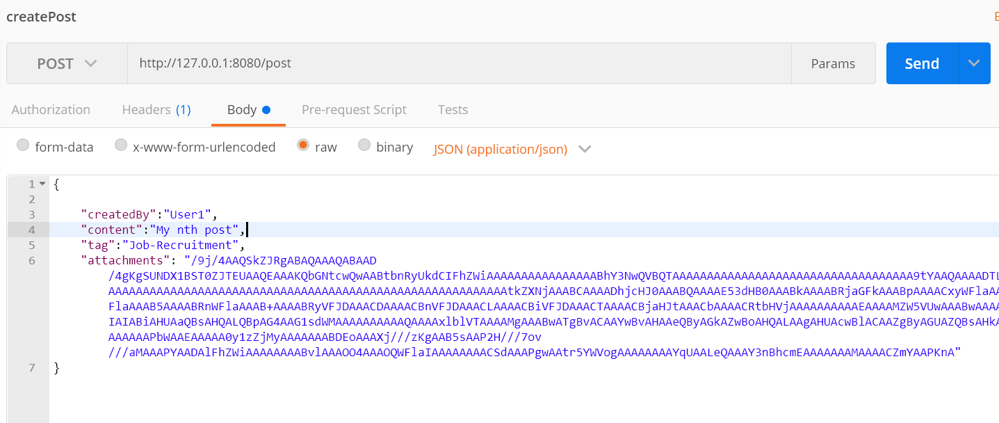
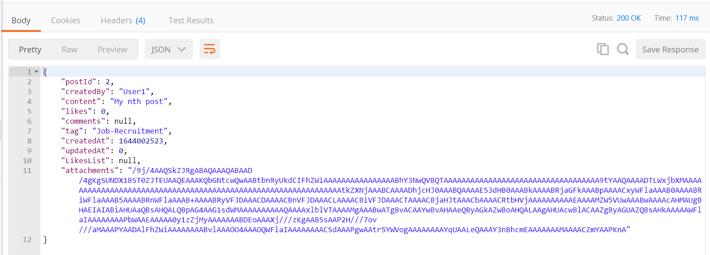
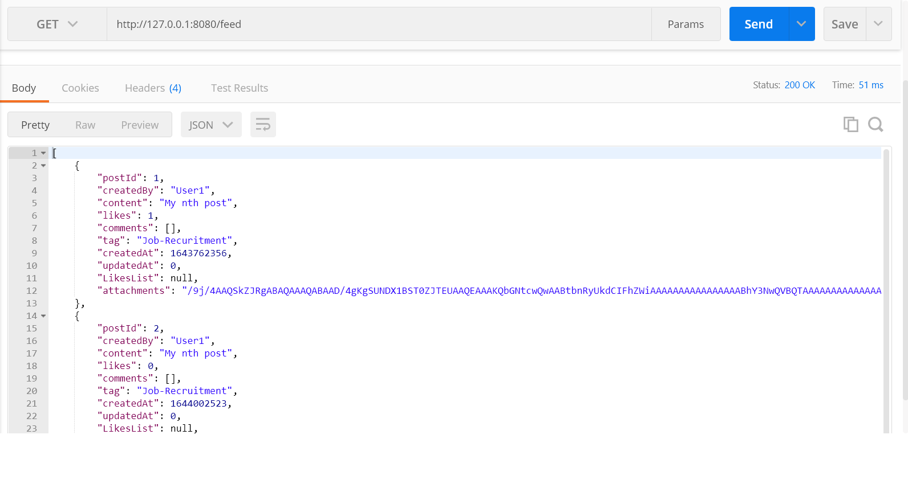
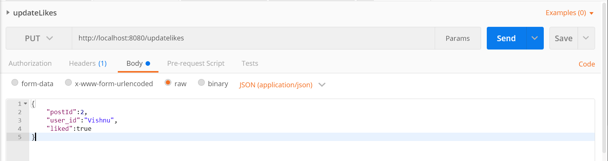
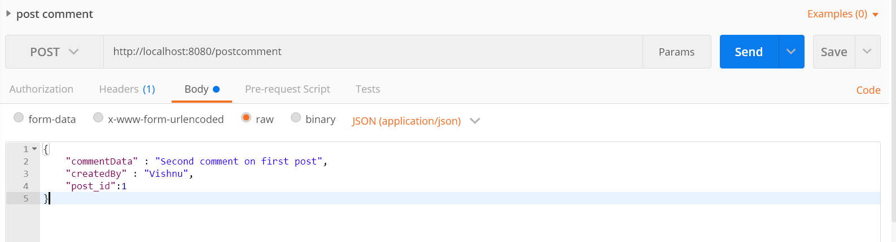
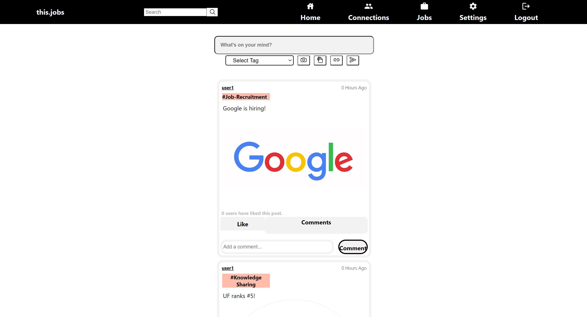

# this.jobs - sprint 1
### Group Members
Ranjeet Mallipeddi (Frontend)\
Syama Vangmayi Vydyula (Frontend)\
Vishnuvardhan Reddy Jammula (Backend)\
Sai Sneha Paruchuri (Backend)

Github repository link: [https://github.com/flash29/this.jobs](https://github.com/flash29/this.jobs)
### Outline
  
  this.jobs is a platform where people can build their profile, connect with other users who share similar interests in careers and find/ apply or post new jobs

### Demo
  Combined demo link is found [here](https://uflorida-my.sharepoint.com/personal/paruchuri_s_ufl_edu/_layouts/15/onedrive.aspx?id=%2Fpersonal%2Fparuchuri%5Fs%5Fufl%5Fedu%2FDocuments%2FSE%5Fsprint1%2Fsprint1%5Fmerged%2Emp4&parent=%2Fpersonal%2Fparuchuri%5Fs%5Fufl%5Fedu%2FDocuments%2FSE%5Fsprint1)

Technical stack, their pre-requisites and how to setup and run both frontend and backend can be found at this [wiki](https://github.com/flash29/this.jobs/wiki/Installation)

### Backend accomplishments
- Created REST API's to create post, retrieve all posts, comment on a post, like/dislike a post. Api's accept json as data input and produces json responses
- Post creation supports attaching images when encoded in Base64 format.
- Defined the data models for post creation, comment and likes. GORM is used to automigrate the model schema to SQLite tables.
- All the data is persisted and fetched from SQLite tables related to the application.
- More about REST api's documentation can be found at this [wiki](https://github.com/flash29/this.jobs/wiki/REST-API-Documentation)

Backend demo link is found [here](https://uflorida-my.sharepoint.com/personal/paruchuri_s_ufl_edu/_layouts/15/onedrive.aspx?id=%2Fpersonal%2Fparuchuri%5Fs%5Fufl%5Fedu%2FDocuments%2FSE%5Fsprint1%2Fsprint1%5Fbackend%2Emp4&parent=%2Fpersonal%2Fparuchuri%5Fs%5Fufl%5Fedu%2FDocuments%2FSE%5Fsprint1)

### REST API

#### Create Post
The end point
```
http://localhost:8080/post
```
is used to create new posts, it is a `POST` method and the json data of UserPost structure is mentioned below


`createdBy` , `content` and `tag` are mandatory fields to create a new post.
`attachments` can be any file which is base64 encoded

After sucessful creation of post, the following response with status `200` is seen.



Incase of error the status will be `400` with the error message "unable to create post" 

#### Retrieve Feed
The end point
```
http://localhost:8080/feed
```
is used to create new posts, it is a `GET` method without any parameters. The following response with status `200` is seen after successful retrieval.



Incase of error the status will be `400` with the error message "unable to retrieve feed posts" 

#### Update Likes

The end point
```
http://localhost:8080/updatelikes
```
is used to create new posts, it is a `PUT` method and the json data of Like structure is mentioned below and all the fields are mandatory.



`updated likes` will be the success response with status `200`.

Incase of error the status will be `400` with the error message "You already liked the post" 

#### Post Comment

The end point
```
http://localhost:8080/postcomment
```
is used to create new posts, it is a `POST` method and the json data of Like structure is mentioned below all the fields are mandatory.



The success response will be the comment data with status `200`.

Incase of error the status will be `400` with the error message "Unable to add comment"


### Frontend accomplishments
- Created the homepage of the application
- Created the navigation bar and routes to the various links on the navigation bar - home, jobs, connections, settings
- Created a searchBar which allows a user to perform search operations. (currently routes to a different page which is to be developed in further sprints)
- Created a postBox which allows users to create a post with multimedia content - photos, pdfs and links. Further, the mandatory comment and tag fields are a part of the post-box. Tags help users to search for relevant content that they are looking for. Each time a user creates a post, the post gets updated on the user's feed. This component appears on the home page of the application.
- Created a PostCard which automatically gets loaded onto a user's feed when he/she posts something. This feature has like and comment options which were also developed. Further, in the user's feed, the posts are displayed in the order of relevance.
- More about frontend documentation can be found at this [wiki](https://github.com/flash29/this.jobs/wiki/File-Structure)

Frontend demo link is found [here](https://uflorida-my.sharepoint.com/personal/paruchuri_s_ufl_edu/_layouts/15/onedrive.aspx?id=%2Fpersonal%2Fparuchuri%5Fs%5Fufl%5Fedu%2FDocuments%2FSE%5Fsprint1%2Fsprint1%5Ffrontend%2Emp4&parent=%2Fpersonal%2Fparuchuri%5Fs%5Fufl%5Fedu%2FDocuments%2FSE%5Fsprint1)

### Frontend HomePage



