# this.jobs - sprint 2
### Group Members
Ranjeet Mallipeddi (Frontend)\
Syama Vangmayi Vydyula (Frontend)\
Vishnuvardhan Reddy Jammula (Backend)\
Sai Sneha Paruchuri (Backend)

Github repository link: [https://github.com/flash29/this.jobs](https://github.com/flash29/this.jobs)
### Outline
  
  this.jobs is a platform where people can build their profile, connect with other users who share similar interests in careers and find/ apply or post new jobs

### Demo
  Combined demo link is found [here]()

Technical stack, their pre-requisites and how to setup and run both frontend and backend can be found at this [wiki](https://github.com/flash29/this.jobs/wiki/Installation)

### Backend accomplishments
- Created REST API's to register user, login, update the user profile details like Bio and Display Picture, add and update education details, add and update job deatils and project details. Api's accept json as data input and produces json responses
- User registration takes basic details like user name, email and password. All the other details in the profile can be updated using the update APIs
- User Login and registration are public APIs and all other APIs are protected and authorized based on the JSON Web Token which is created after successful login.
- Defined the data models for user, education, job and projects. GORM is used to automigrate the model schema to SQLite tables.
- All the data is persisted and fetched from SQLite tables related to the application.
- Unitests are created for all the APIs in the appropriate controller files.
- More about REST api's documentation can be found at this [wiki](https://github.com/flash29/this.jobs/wiki/REST-API-Documentation)

Backend demo link is found [here]()

### REST API

#### Register User

URL: `<base_url>/auth/register`

Request Method: `POST`

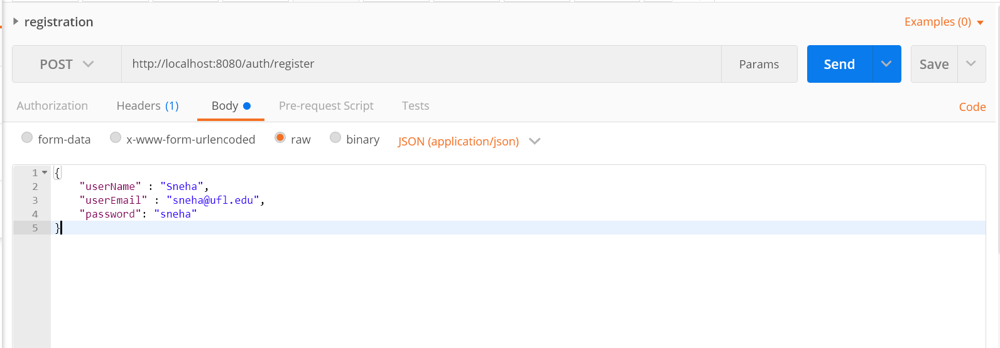

Id associated to the user is an auto-incrementing value and is assigned directly in the database. `userName, userEmail` and `password` are required fields to register any user. All other user related details can be updated later in the profile section.
Response:

Possible Response status : `201, 400`

Example: Response status 201
The user has been registered and the response with status 201 shows the newly created user details.

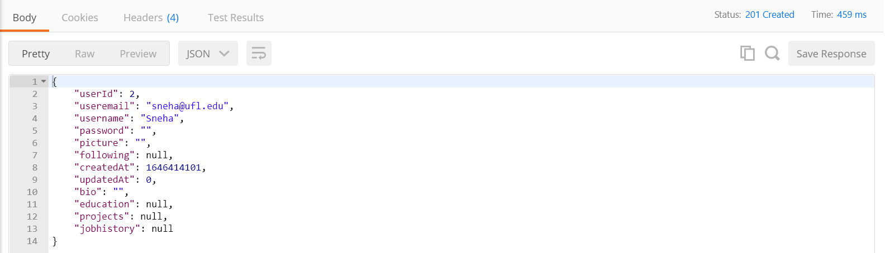

#### Login

URL: `<base_url>/auth/login`

Request Method: `POST`

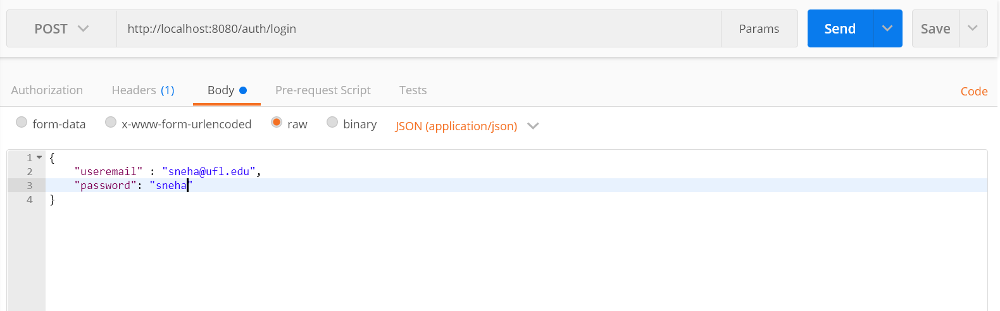
Both `useremail` and `password` are required. 
Response:

Possible Response status : `200, 400`

Example:

Response status : `200`

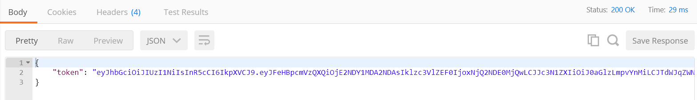

#### Get User Profile
URL: `<base_url>/userprofile/:id`

Request Method: `GET`
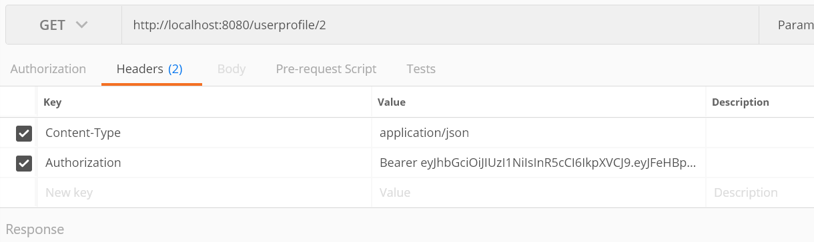
Possible Response status: `200, 404`

Message format: `json`

Example

Code: 200 OK

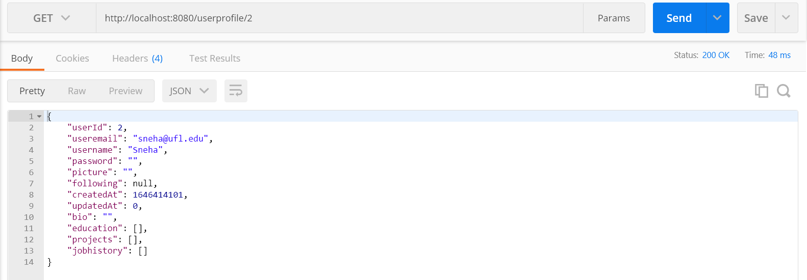
#### Update Profile Picture
URL: `<base_url>/updatepic`

Request Method: `PUT`


All the fields are mandatory

Possible Response status: `200, 400`

Message format: `json`

Example

Code: 200 OK

```
{
        "message": "Profile photo uploaded successfully"
}
```

#### Update Bio
URL: `<base_url>/updatebio`

Request Method: `PUT`

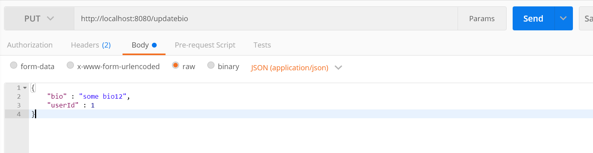
All the fields are mandatory

Possible Response status: `200, 400`

Message format: `json`

Example

Code: 200 OK


#### Add Education Details
URL: `<base_url>/addeducation`

Request Method: `POST`


Possible Response status: `201, 400`

Message format: `json`

Example

Code: 200 OK

```
{
        "educationId" : 1,
        "insName": "UF",
        "timeline": "string format of time",
        "gpa" : "",
        "userId" : 1
}
```
#### Add Job Details
URL: `<base_url>/addjob`

Request Method: `POST`

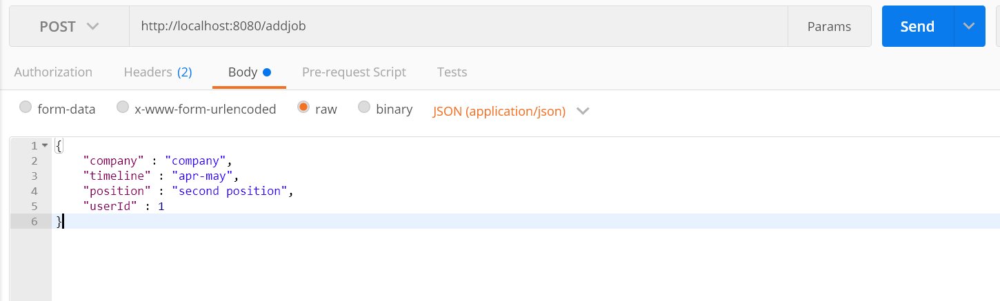

Possible Response status: `201, 400`

Message format: `json`

Example

Code: 200 OK

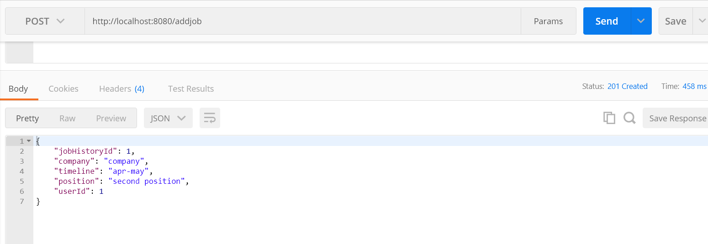

#### Add Project Details
URL: `<base_url>/addproject`

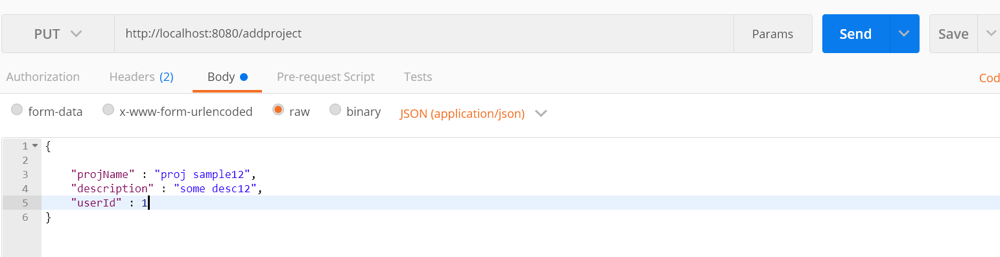


Possible Response status: `201, 400`

Message format: `json`

Example

Code: 201 Created

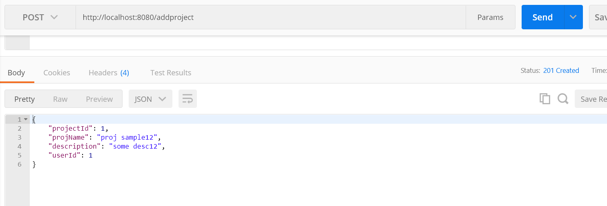

#### Update Education Details
URL: `<base_url>/updateducation`

Request Method: `PUT`


educationId and userId are mandatory

Possible Response status: `201, 400`

Message format: `json`

Example

Code: 200 OK

```
{
        "educationId" : 1,
        "insName": "UF",
        "timeline": "string format of time",
        "gpa" : "",
        "userId" : 1
}
```

#### Update Job Details
URL: `<base_url>/updatejob`

Request Method: `PUT`

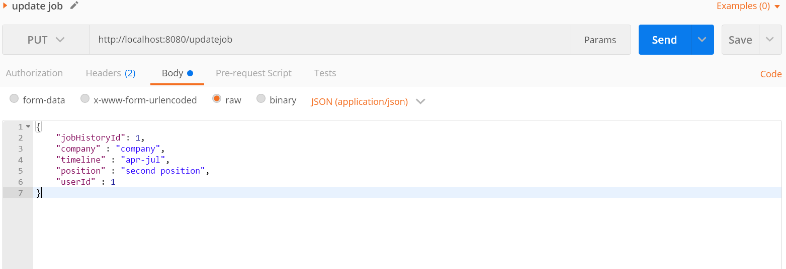
jobHistoryId and userId are mandatory

Possible Response status: `201, 400`

Message format: `json`

Example

Code: 200 OK

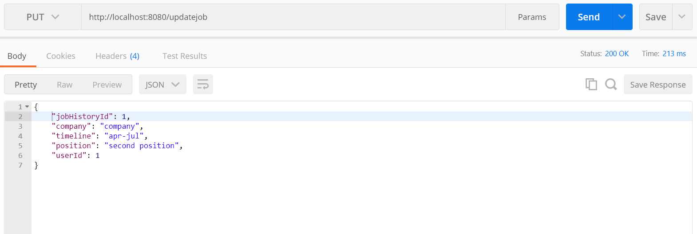


#### Update Project Details
URL: `<base_url>/updateproject`

Request Method: `PUT`

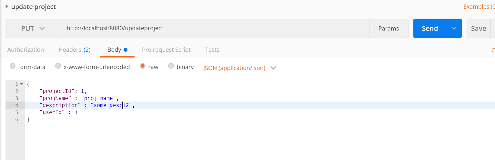
projectId and userId are mandatory

Possible Response status: `201, 400`

Message format: `json`

Example

Code: 200 OK

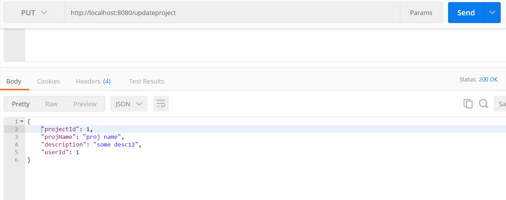

### Frontend accomplishments
Main (Goals reached): 
> Integrated front-end and back-end
> Created Tests using Cypress
> Created Unit Tests using jest

Details :
- Created the login page where the user can login to their account if it already exists or click the register button to go to the registration page
- Created the registration page where the user can register. They have to enter their name, email and password. An already existing user cannot register again.
- Created the myProfile page which contains all the details that the user can update at any point. This page would consist of User's name, display picture, Education, Work Experience and projects. Each of these sections further contain more details which the user can update whenever they want. 
- Created unit tests for the Login Page using jest - 
  1. LoginPage title shows 
  2. Input fields -  email, password
  3. Buttons - login, registration
  4. Component rendering - LoginPage, LoginForm (snapshot tests)     
  5. Routes - /auth/login, /registration
- Created unit tests for the registration page using jest- 
  1. Title
  2. Input fields - name, email, password
  3. component rendering - RegPage, RegForm (snapshot tests)
  4. Routes - /auth/login, /auth/register, /
- Created unit tests for the home page using jest - 
  1. component rendering (snapshot tests) - Home, NavBar, PostBox, PostCard
  2. Routes from home - /feed
  3. NavBar tests :
     * title
     * Routes - /home, /connections, /jobs, /settings, /login
  4. PostBox commentBox working
- Cypress tests : For integration testing
- Here is the output of the cypress tests:
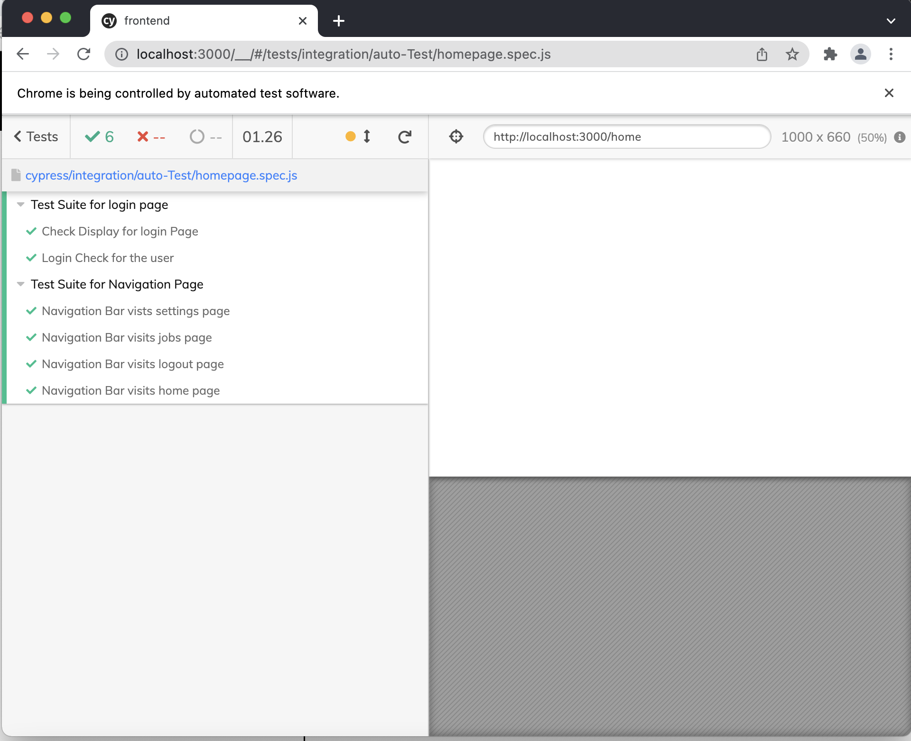

- More details about frontend documentation can be found at -> [wiki](https://github.com/flash29/this.jobs/wiki/File-Structure)

Frontend demo link is found [here]()

### Frontend HomePage


### Login Page
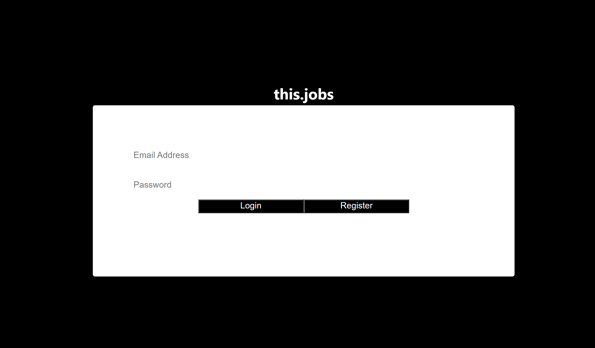

### Registration Page
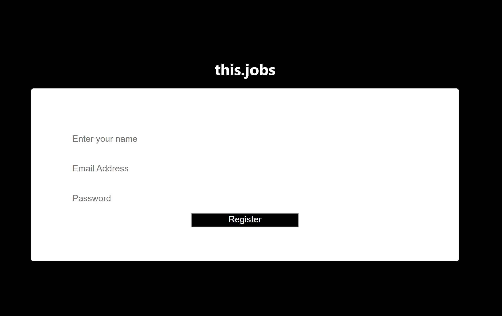

### Profile Page
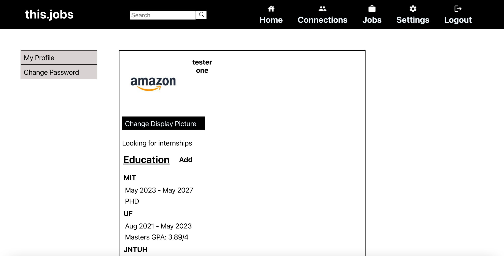
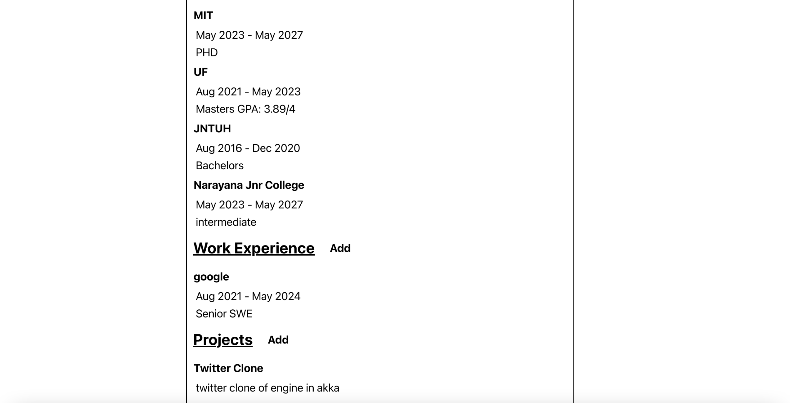

## Testing Results - 

### Login Page Tests :


### Registration Page Tests :


### Home Page Tests :


### App page basic test :


