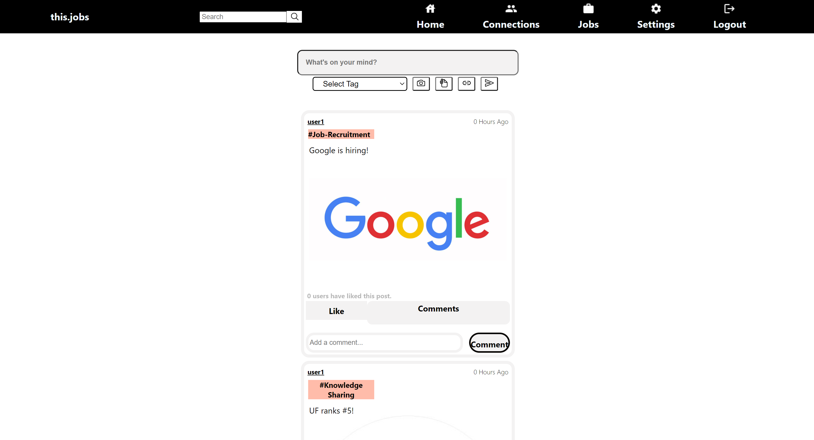

# this.jobs - sprint 1
### Group Members
Ranjeet Mallipeddi (Frontend)\
Syama Vangmayi Vydyula (Frontend)\
Vishnuvardhan Reddy Jammula (Backend)\
Sai Sneha Paruchuri (Backend)

Github repository link: [https://github.com/flash29/this.jobs](https://github.com/flash29/this.jobs)
### Outline
  
  this.jobs is a platform where people can build their profile, connect with other users who share similar interests in careers and find/ apply or post new jobs

### Demo
  Combined demo link is found [here]()

Technical stack, their pre-requisites and how to setup and run both frontend and backend can be found at this [wiki](https://github.com/flash29/this.jobs/wiki/Installation)

### Backend accomplishments
- Created REST API's to register user, login, update the user profile details like Bio and Display Picture, add and update education details, add and update job deatils and project details. Api's accept json as data input and produces json responses
- User registration takes basic details like user name, email and password. All the other details in the profile can be updated using the update APIs
- User Login and registration are public APIs and all other APIs are protected and authorized based on the JSON Web Token which is created after successful login.
- Defined the data models for user, education, job and projects. GORM is used to automigrate the model schema to SQLite tables.
- All the data is persisted and fetched from SQLite tables related to the application.
- Unitests are created for all the APIs in the appropriate controller files.
- More about REST api's documentation can be found at this [wiki](https://github.com/flash29/this.jobs/wiki/REST-API-Documentation)

Backend demo link is found [here]()

### REST API

#### Register User

URL: `<base_url>/auth/register`

Request Method: `POST`


Id associated to the user is an auto-incrementing value and is assigned directly in the database. `userName, userEmail` and `password` are required fields to register any user. All other user related details can be updated later in the profile section.
Response:

Possible Response status : `201, 400`

Example: Response status 201
The user has been registered and the response with status 201 shows the newly created user details.


#### Login

URL: `<base_url>/auth/login`

Request Method: `POST`


Both `useremail` and `password` are required. 
Response:

Possible Response status : `200, 400`

Example:

Response status : `200`


#### Get User Profile
URL: `<base_url>/userprofile/:id`

Request Method: `GET`

Possible Response status: `200, 404`

Message format: `json`

Example

Code: 200 OK


#### Update Profile Picture
URL: `<base_url>/updatepic`

Request Method: `PUT`

Payload: 
```
{
        "userId": 1,
        "picture": "base64 string"
}
```
All the fields are mandatory

Possible Response status: `200, 400`

Message format: `json`

Example

Code: 200 OK

```
{
        "message": "Profile photo uploaded successfully"
}
```

#### Update Bio
URL: `<base_url>/updatebio`

Request Method: `PUT`


All the fields are mandatory

Possible Response status: `200, 400`

Message format: `json`

Example

Code: 200 OK


#### Add Education Details
URL: `<base_url>/addeducation`

Request Method: `POST`

Payload: 
```
{
        "insName": "UF",
        "timeline": "string format of time",
        "gpa" : "",
        "userId" : 1
}
```

Possible Response status: `201, 400`

Message format: `json`

Example

Code: 200 OK

```
{
        "educationId" : 1,
        "insName": "UF",
        "timeline": "string format of time",
        "gpa" : "",
        "userId" : 1
}
```
#### Add Job Details
URL: `<base_url>/addjob`

Request Method: `POST`

Payload: 
```
{
        "company" : "company 123",
	"timeline" : "some time123",
	"position" : "second position",
	"userId" : 2
}
```

Possible Response status: `201, 400`

Message format: `json`

Example

Code: 200 OK

```
{
        "jobHistoryId" : 1,
        "company" : "company 123",
	"timeline" : "some time123",
	"position" : "second position",
	"userId" : 2
}
```

#### Add Project Details
URL: `<base_url>/addproject`

Request Method: `POST`

Payload: 
```
{
        "projName" : "proj sample12",
	"description" : "some desc12",
	"userId" : 2
}
```

Possible Response status: `201, 400`

Message format: `json`

Example

Code: 200 OK

```
{
        "projectId" : 1,
        "projName" : "proj sample12",
	"description" : "some desc12",
	"userId" : 2
}
```

#### Update Education Details
URL: `<base_url>/updateducation`

Request Method: `PUT`

Payload: 
```
{
        "educationId" : 1,
        "insName": "UF",
        "timeline": "string format of time",
        "gpa" : "",
        "userId" : 1
}
```
educationId and userId are mandatory

Possible Response status: `201, 400`

Message format: `json`

Example

Code: 200 OK

```
{
        "educationId" : 1,
        "insName": "UF",
        "timeline": "string format of time",
        "gpa" : "",
        "userId" : 1
}
```

#### Update Job Details
URL: `<base_url>/updatejob`

Request Method: `PUT`

Payload: 
```
{
        "jobHistoryId": 1,
	"company" : "company 123",
	"timeline" : "some time123",
	"position" : "second position",
	"userId" : 2
}
```
jobHistoryId and userId are mandatory

Possible Response status: `201, 400`

Message format: `json`

Example

Code: 200 OK

```
{
        "jobHistoryId": 1,
	"company" : "company 123",
	"timeline" : "some time123",
	"position" : "second position",
	"userId" : 2
}
```

#### Update Job Details
URL: `<base_url>/updatjob`

Request Method: `PUT`

Payload: 
```
{
        "jobHistoryId": 1,
	"company" : "company 123",
	"timeline" : "some time123",
	"position" : "second position",
	"userId" : 2
}
```
jobHistoryId and userId are mandatory

Possible Response status: `201, 400`

Message format: `json`

Example

Code: 200 OK

```
{
        "jobHistoryId": 1,
	"company" : "company 123",
	"timeline" : "some time123",
	"position" : "second position",
	"userId" : 2
}
```

#### Update Project Details
URL: `<base_url>/updateproject`

Request Method: `PUT`

Payload: 
```
{
        "projectId" : 1,
	"projName" : "proj sample12",
	"description" : "some desc12",
	"userId" : 2
}
```
projectId and userId are mandatory

Possible Response status: `201, 400`

Message format: `json`

Example

Code: 200 OK

```
{
  "projectId" : 1,
	"projName" : "proj sample12",
	"description" : "some desc12",
	"userId" : 2
}
```

### Frontend accomplishments
- Created the homepage of the application
- Created the navigation bar and routes to the various links on the navigation bar - home, jobs, connections, settings
- Created a searchBar which allows a user to perform search operations. (currently routes to a different page which is to be developed in further sprints)
- Created a postBox which allows users to create a post with multimedia content - photos, pdfs and links. Further, the mandatory comment and tag fields are a part of the post-box. Tags help users to search for relevant content that they are looking for. Each time a user creates a post, the post gets updated on the user's feed. This component appears on the home page of the application.
- Created a PostCard which automatically gets loaded onto a user's feed when he/she posts something. This feature has like and comment options which were also developed. Further, in the user's feed, the posts are displayed in the order of relevance.
- More about frontend documentation can be found at this [wiki](https://github.com/flash29/this.jobs/wiki/File-Structure)

Frontend demo link is found [here]()

### Frontend HomePage



