# this.jobs - sprint 3
### Group Members
Ranjeet Mallipeddi (Frontend)\
Syama Vangmayi Vydyula (Frontend)\
Vishnuvardhan Reddy Jammula (Backend)\
Sai Sneha Paruchuri (Backend)

Github repository link: [https://github.com/flash29/this.jobs](https://github.com/flash29/this.jobs)
### Outline
  
  this.jobs is a platform where people can build their profile, connect with other users who share similar interests in careers and find/ apply or post new jobs

### Demo
  Complete demo is [here](https://uflorida-my.sharepoint.com/:v:/g/personal/paruchuri_s_ufl_edu/Ebq6MqNzeB1JvOP0E6BgQWcBRGUettYrvuitUOY5-hlpIg?e=kz5735)
  
  Backend demo can be found [here](https://uflorida-my.sharepoint.com/:v:/g/personal/paruchuri_s_ufl_edu/ESe2aRQV1EJBql33SgX3aKwByNG2kP7luArSH2HwE4rezQ?e=bmgvYP) 

  Frontend demo can be found [here](https://uflorida-my.sharepoint.com/:v:/g/personal/paruchuri_s_ufl_edu/EVFS-O8gn85Ctbjocb98rmIB1zLLNx-wRiKfuXkstvbBHg?e=SUtDBM)


Technical stack, their pre-requisites and how to setup and run both frontend and backend can be found at this [wiki](https://github.com/flash29/this.jobs/wiki/Installation)

### Backend accomplishments
- Created REST API's to upload resume in user profile, create, update and delete jobs as a recruiter and apply to jobs as user, few other APIs to display the list of existing jobs, applied jobs and the users who applied to the jobs posted by logged in user. Api's accept json as data input and produces json responses
- Create Job takes basic details like job title, organization, salary, deadlines and location. All the details can be updated.
- Users can view all the posted jobs and apply to them. Multiple applications are not allowed and recruiters will not accept the applications post the mentioned deadline.
- Defined the data models for jobs and applications. GORM is used to automigrate the model schema to SQLite tables.
- All the data is persisted and fetched from SQLite tables related to the application.
- Unitests are created for all the APIs in the appropriate controller files.
- More about REST api's documentation can be found at this [wiki](https://github.com/flash29/this.jobs/wiki/REST-API-Documentation)


### REST API

#### Create a Job

URL: `<base_url>/jobpost`

Request Method: `POST`

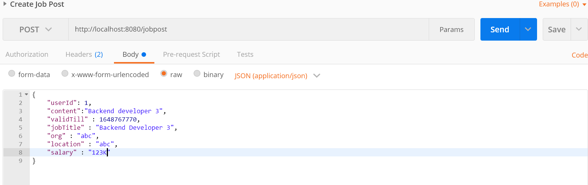

Id associated to the job is an auto-incrementing value and is assigned directly in the database. `userId, content, jobTitle, org, validTill, locatio` and `location` are required fields to post a job.
Response:

Possible Response status : `200, 400`

Example: Response status 200
The job has been created and the response with status 200 shows the newly created job details with id.

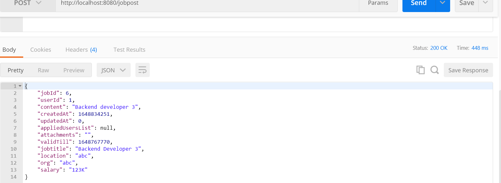

#### Update Job

URL: `<base_url>/jobposts`

Request Method: `PUT`

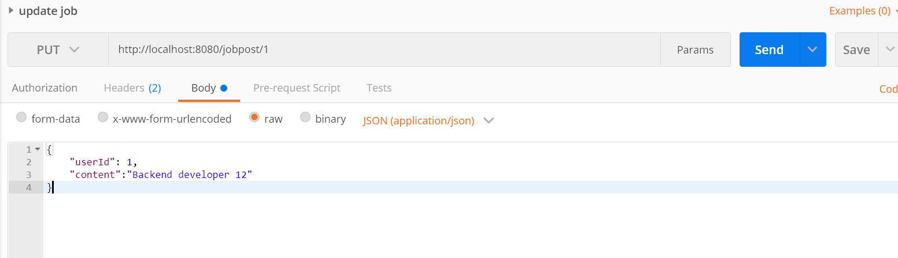
The `jobId` which is sent as URL parameter is required field, remaining fields which are to be updated should be sent over payload. 
Response:

Possible Response status : `200, 400`

Example:

Response status : `200`

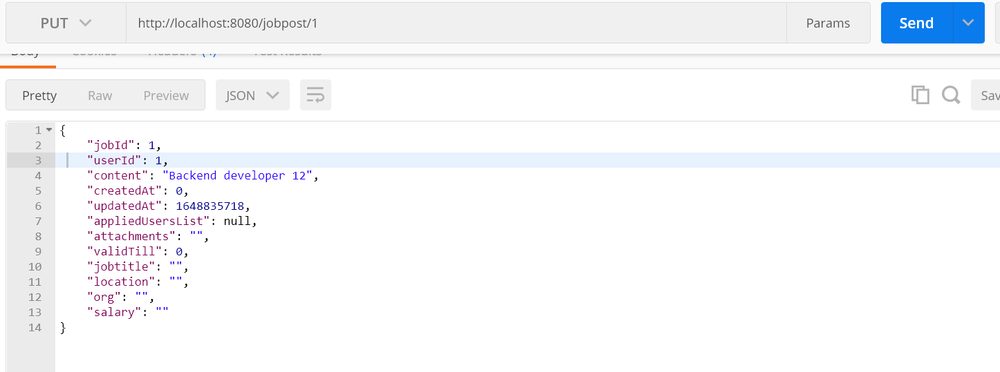

#### Apply to a Job
URL: `<base_url>/applyjob`

Request Method: `POST`
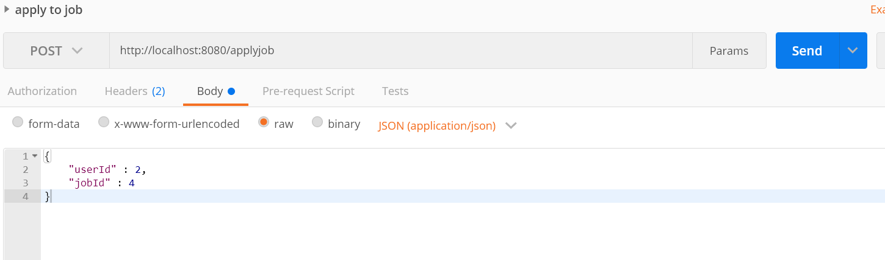
Applying `userId` and the `jobId` to which they are applying are required fields.
Possible Response status: `200, 400`

Message format: `json`

Example

Code: 200 OK

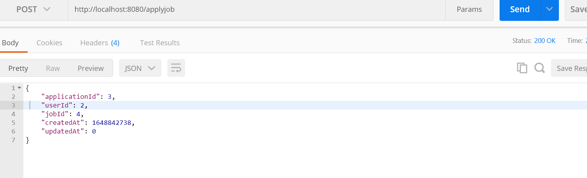

If the user tries to apply after the deadline, the following error message is sent.

Code: 400 Bad Request

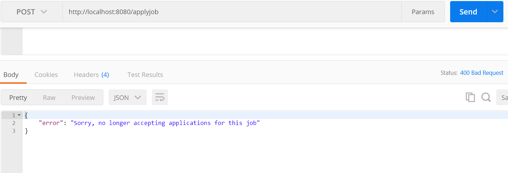

In case of duplicate appliction the error message is as below

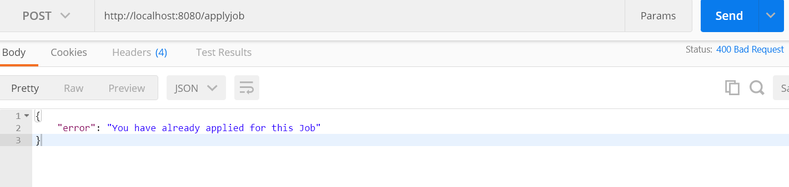
#### Retrieve Jobs
URL: `<base_url>/getalljobs`

Request Method: `GET`

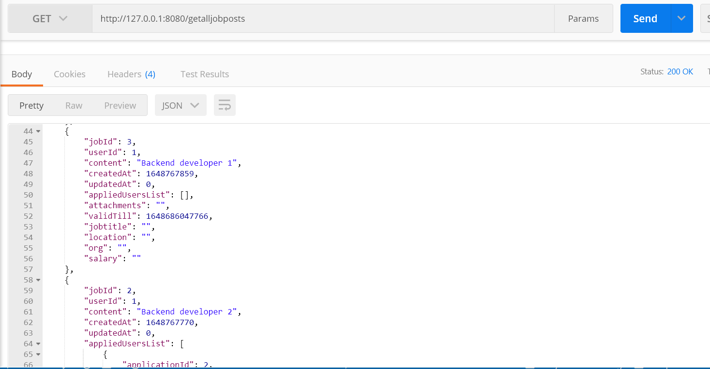


Possible Response status: `200, 404`

Message format: `json`

Example

Code: 200 OK

```
[
    {
        "jobId": 4,
        "userId": 1,
        "content": "Job posting 1",
        "createdAt": 1648753603,
        "updatedAt": 0,
        "appliedUsersList": [],
        "attachments": "",
        "validTill" : 1648767770,
        "jobTitle" : "Backend Developer 3",
        "org" : "abc",
        "location" : "abc",
        "salary" : "123K"
    }
]
```

#### Retrieve Jobs posted by Recruiter
List of jobs along with the Applicant Ids are retrieved.

URL: `<base_url>/getjobs/<user_id>`

Request Method: `GET`

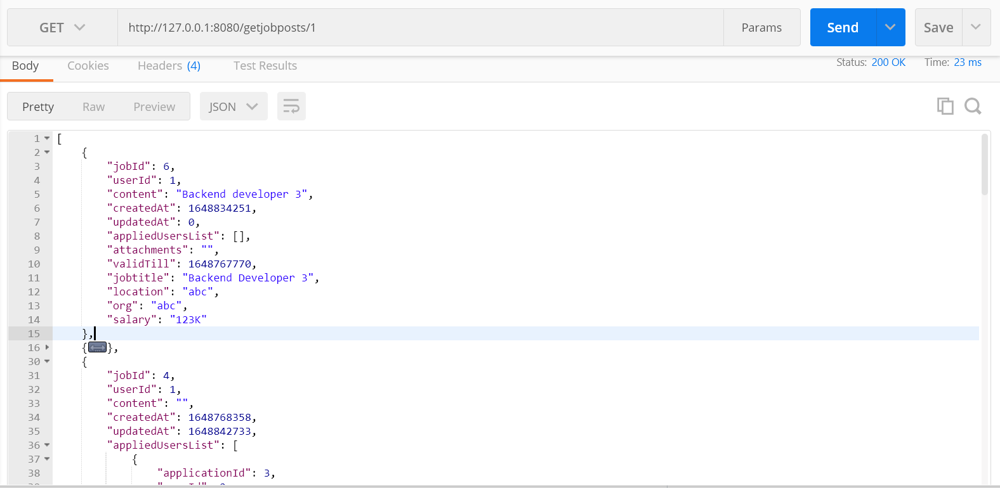


Possible Response status: `200, 404`

Message format: `json`

Example

Code: 200 OK

```
[
    {
        "jobId": 4,
        "userId": 1,
        "content": "Job posting 1",
        "createdAt": 1648753603,
        "updatedAt": 0,
        "appliedUsersList":  [
                                 {
                                 "applicationId": 2,
                                 "userId": 2,
                                 "jobId": 2,
                                 "createdAt": 1648767785,
                                 "updatedAt": 0
                                 }
                              ],
        "attachments": "",
        "validTill" : 1648767770,
        "jobTitle" : "Backend Developer 3",
        "org" : "abc",
        "location" : "abc",
        "salary" : "123K"
    }
]
```
#### Retrieve My Applications
URL: `<base_url>/getappliedjobs/<user_id>`

Request Method: `GET`

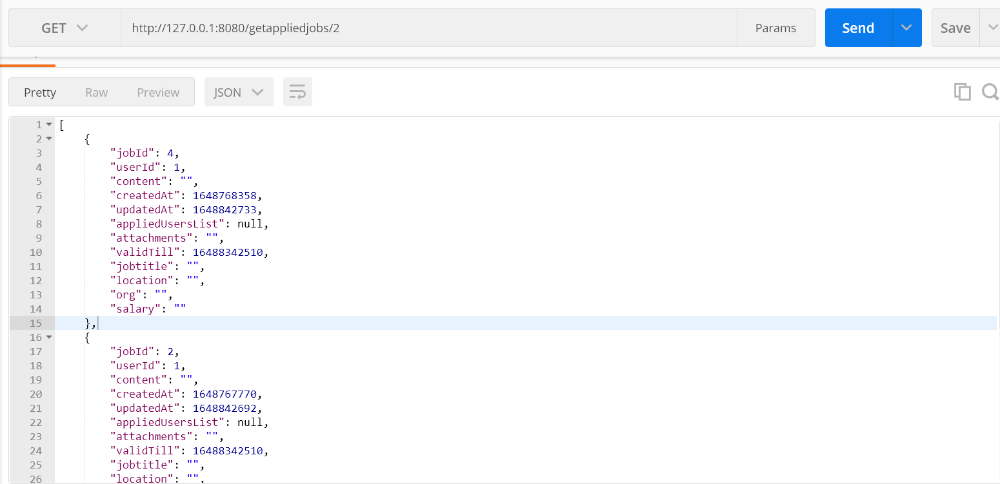


Possible Response status: `200, 404`

Message format: `json`

Example

Code: 200 OK

```
[
    {
        "jobId": 4,
        "userId": 1,
        "content": "Job posting 1",
        "createdAt": 1648753603,
        "updatedAt": 0,
        "appliedUsersList": [],
        "attachments": "",
        "validTill" : 1648767770,
        "jobTitle" : "Backend Developer 3",
        "org" : "abc",
        "location" : "abc",
        "salary" : "123K"
    }
]
```

#### Unit Tests

A mock database is created and unit tests are performed on the data from mock DB. The below sections show the unit testing output along with their coverage
#### Create, Retrieve and Apply Jobs

Test cases include job creation, updation and deletion with valid and invalid details and also applying to the job.


### Frontend accomplishments
