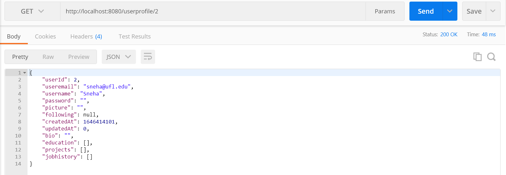
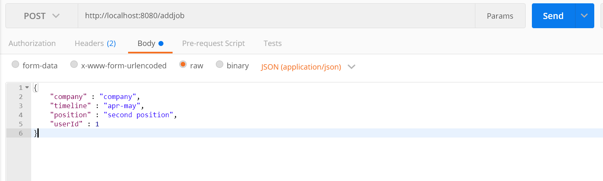
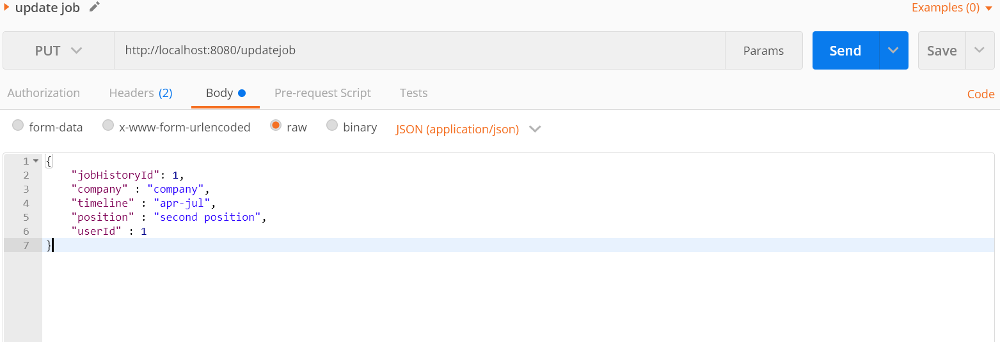

# this.jobs - sprint 2
### Group Members
Ranjeet Mallipeddi (Frontend)\
Syama Vangmayi Vydyula (Frontend)\
Vishnuvardhan Reddy Jammula (Backend)\
Sai Sneha Paruchuri (Backend)

Github repository link: [https://github.com/flash29/this.jobs](https://github.com/flash29/this.jobs)
### Outline
  
  this.jobs is a platform where people can build their profile, connect with other users who share similar interests in careers and find/ apply or post new jobs

### Demo
  Complete demo is [here](https://uflorida-my.sharepoint.com/:v:/g/personal/paruchuri_s_ufl_edu/Ebq6MqNzeB1JvOP0E6BgQWcBRGUettYrvuitUOY5-hlpIg?e=kz5735)
  
  Backend demo can be found [here](https://uflorida-my.sharepoint.com/:v:/g/personal/paruchuri_s_ufl_edu/ESe2aRQV1EJBql33SgX3aKwByNG2kP7luArSH2HwE4rezQ?e=bmgvYP) 

  Frontend demo can be found [here](https://uflorida-my.sharepoint.com/:v:/g/personal/paruchuri_s_ufl_edu/EVFS-O8gn85Ctbjocb98rmIB1zLLNx-wRiKfuXkstvbBHg?e=SUtDBM)


Technical stack, their pre-requisites and how to setup and run both frontend and backend can be found at this [wiki](https://github.com/flash29/this.jobs/wiki/Installation)

### Backend accomplishments
- Created REST API's to upload resume in user profile, create, update and delete jobs as a recruiter and apply to jobs as user, few other APIs to display the list of existing jobs, applied jobs and the users who applied to the jobs posted by logged in user. Api's accept json as data input and produces json responses
- Create Job takes basic details like job title, organization, salary, deadlines and location. All the details can be updated.
- Users can view all the posted jobs and apply to them. Multiple applications are not allowed and recruiters will not accept the applications post the mentioned deadline.
- Defined the data models for jobs and applications. GORM is used to automigrate the model schema to SQLite tables.
- All the data is persisted and fetched from SQLite tables related to the application.
- Unitests are created for all the APIs in the appropriate controller files.
- More about REST api's documentation can be found at this [wiki](https://github.com/flash29/this.jobs/wiki/REST-API-Documentation)


### REST API

#### Create a Job

URL: `<base_url>/jobpost`

Request Method: `POST`


Id associated to the job is an auto-incrementing value and is assigned directly in the database. `userId, content, jobTitle, org, validTill, locatio` and `location` are required fields to post a job.
Response:

Possible Response status : `200, 400`

Example: Response status 200
The job has been created and the response with status 200 shows the newly created job details with id.


#### Update Job

URL: `<base_url>/jobposts`

Request Method: `PUT`


The `jobId` which is sent as URL parameter is required field, remaining fields which are to be updated should be sent over payload. 
Response:

Possible Response status : `200, 400`

Example:

Response status : `200`


#### Get User Profile
URL: `<base_url>/userprofile/:id`

Request Method: `GET`

Possible Response status: `200, 404`

Message format: `json`

Example

Code: 200 OK


#### Update Profile Picture
URL: `<base_url>/updatepic`

Request Method: `PUT`


All the fields are mandatory

Possible Response status: `200, 400`

Message format: `json`

Example

Code: 200 OK

```
{
        "message": "Profile photo uploaded successfully"
}
```

#### Update Bio
URL: `<base_url>/updatebio`

Request Method: `PUT`


All the fields are mandatory

Possible Response status: `200, 400`

Message format: `json`

Example

Code: 200 OK


#### Add Education Details
URL: `<base_url>/addeducation`

Request Method: `POST`


Possible Response status: `201, 400`

Message format: `json`

Example

Code: 200 OK

```
{
        "educationId" : 1,
        "insName": "UF",
        "timeline": "string format of time",
        "gpa" : "",
        "userId" : 1
}
```
#### Add Job Details
URL: `<base_url>/addjob`

Request Method: `POST`



Possible Response status: `201, 400`

Message format: `json`

Example

Code: 200 OK


#### Add Project Details
URL: `<base_url>/addproject`


Possible Response status: `201, 400`

Message format: `json`

Example

Code: 201 Created


#### Update Education Details
URL: `<base_url>/updateducation`

Request Method: `PUT`


educationId and userId are mandatory

Possible Response status: `201, 400`

Message format: `json`

Example

Code: 200 OK

```
{
        "educationId" : 1,
        "insName": "UF",
        "timeline": "string format of time",
        "gpa" : "",
        "userId" : 1
}
```

#### Update Job Details
URL: `<base_url>/updatejob`

Request Method: `PUT`


jobHistoryId and userId are mandatory

Possible Response status: `201, 400`

Message format: `json`

Example

Code: 200 OK


#### Update Project Details
URL: `<base_url>/updateproject`

Request Method: `PUT`


projectId and userId are mandatory

Possible Response status: `201, 400`

Message format: `json`

Example

Code: 200 OK


#### Unit Tests

A mock database is created and unit tests are performed on the data from mock DB. The below sections show the unit testing output along with their coverage
#### User Registration

Test cases include User registartion with valid and invalid details and also registering the same user twice.


#### User Login

Test cases include user login with valid and invalid credentials


#### User Proflie

Test cases are included to check the addition and updation of education details, projects and jobs along with bio and display picture updation.


#### Feed

Test cases are included to check the retrieval of feed, posting of new feed, comments ,likes etc.


### Frontend accomplishments
