# this.jobs - sprint 4
### Group Members
Ranjeet Mallipeddi (Frontend)\
Syama Vangmayi Vydyula (Frontend)\
Vishnuvardhan Reddy Jammula (Backend)\
Sai Sneha Paruchuri (Backend)

Github repository link: [https://github.com/flash29/this.jobs](https://github.com/flash29/this.jobs)
### Outline
  
  this.jobs is a platform where people can build their profile, connect with other users who share similar interests in careers and find/ apply or post new jobs

### Demo
  Complete demo is [here](https://uflorida-my.sharepoint.com/:v:/g/personal/paruchuri_s_ufl_edu/EYzrmREymWtCp0nnXiWWM6QBg1Xakiy6IwZsfNo79LmmpQ?e=h3oelv)
  
  Backend demo can be found [here](https://uflorida-my.sharepoint.com/:v:/g/personal/paruchuri_s_ufl_edu/EaLDnL6l7_VPhUuInUm6ILkBJA55_pPUaNtJv-lb9PsHMg?e=Y1UpB9) 

  Frontend demo can be found [here](https://uflorida-my.sharepoint.com/:v:/g/personal/paruchuri_s_ufl_edu/EXF3CeTdwwZFsy5fZhvg85EBT8hBkkdcqowFyz4Gbug0dg?e=QXZn2U)


Technical stack, their pre-requisites and how to setup and run both frontend and backend can be found at this [wiki](https://github.com/flash29/this.jobs/wiki/Installation)

### Backend accomplishments
- Created REST API's to search jobs, people based on company school or names and request, accept or decline connection from other users, few other APIs to display the list of pending requests and connected users are included. Api's accept json as data input and produces json responses
- Search takes a keyword and retrieves users and jobs which contain the query parameter.
- Users can view suggested connections based on their educational institute or their company and send a connection request to them. Multiple requests to the same person are not allowed. The other user can decide to accept or decline the connection request.
- Defined the data models for ConnectionRequest and Token. GORM is used to automigrate the model schema to SQLite tables.
- All the data is persisted and fetched from SQLite tables related to the application.
- Unitests are created for all the APIs in the appropriate controller files.
- More about REST api's documentation can be found at this [wiki](https://github.com/flash29/this.jobs/wiki/REST-API-Documentation)


### REST API

#### Request a Connection

URL: `<base_url>/requestconnection`

Request Method: `POST`

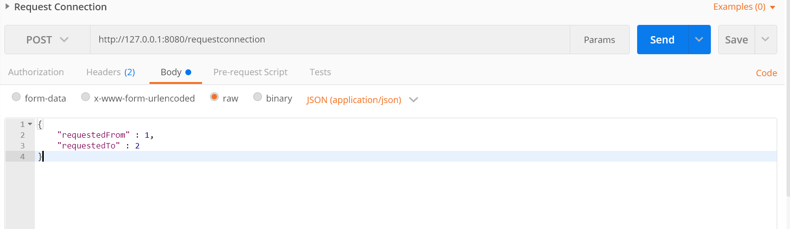

Id associated to the job is an auto-incrementing value and is assigned directly in the database. `requestedFrom` and `requestedTo` are required fields to request a connection.\
Response:

Possible Response status : `200, 400`

Example: Response status 200
The request has been created and the response with status 200 shows the newly created request details with id.

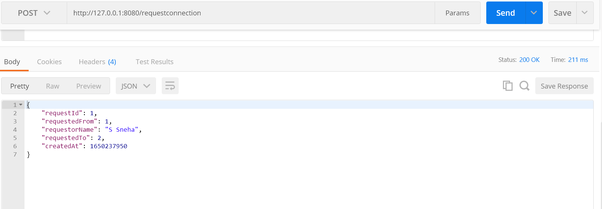

#### Accept a Connection Request

URL: `<base_url>/acceptconnection`

Request Method: `POST`

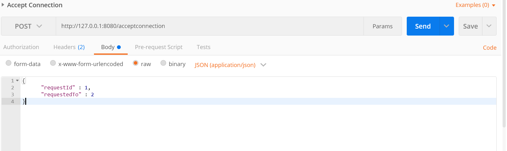

Id associated to the job is an auto-incrementing value and is assigned directly in the database. `requestId` and `requestedTo` are required fields to accept the connection.\
Response:

Possible Response status : `200, 400`

Example: Response status 200
The request has been created and the response with status 200 shows the appropriate success message.

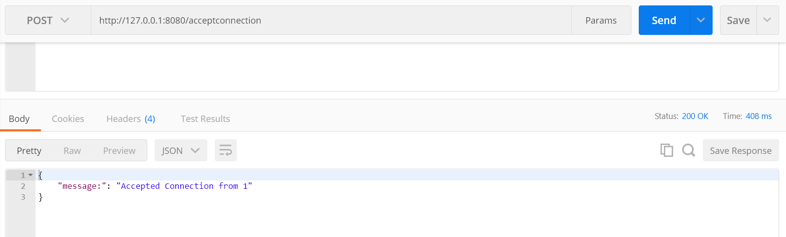

#### Decline a Connection Request

URL: `<base_url>/declineconnection`

Request Method: `POST`

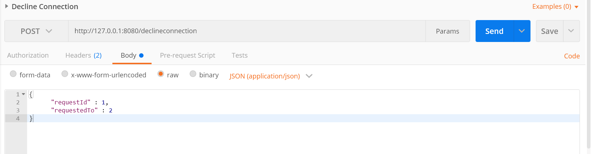

Id associated to the job is an auto-incrementing value and is assigned directly in the database. `requestId` and `requestedTo` are required fields to accept the connection.\
Response:

Possible Response status : `200, 400`

Example: Response status 400
There is no request with the provided request ID so an error message is displayed.

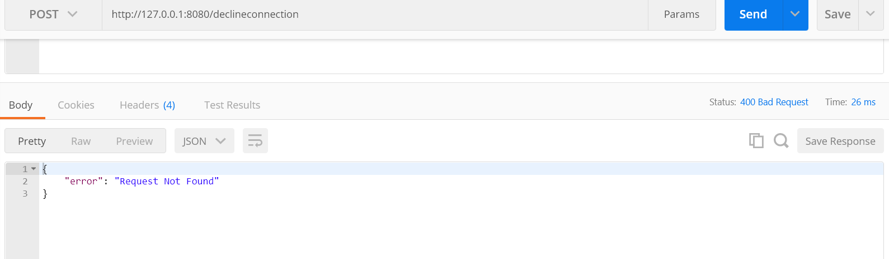

#### Retrieve Pending Connection Requests
URL: `<base_url>/connectionrequests/<user_id>`

Request Method: `GET`

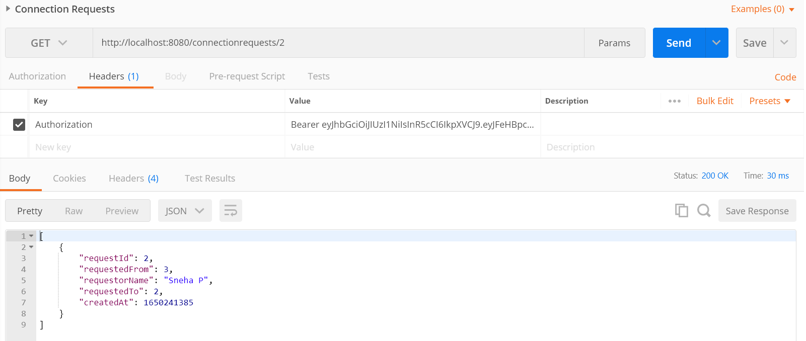


Possible Response status: `200, 404`

Message format: `json`

Example

Code: 200 OK

```
[
    {
        "requestId": 2,
        "requestedFrom": 3,
        "requestorName": "Sneha P",
        "requestedTo": 2,
        "createdAt": 1650241385
    }
]
```

#### People You May Know
List of users with same educational institute or working in the same company are retrieved.

URL: `<base_url>/peopleyoumayknow/<user_id>`

Request Method: `GET`

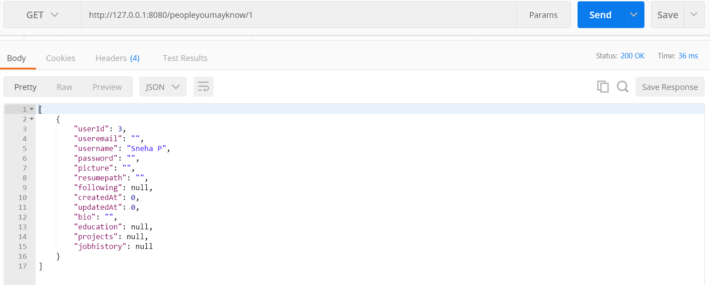


Possible Response status: `200, 404`

Message format: `json`

Example

Code: 200 OK

```
[
    {
        "userId": 3,
        "useremail": "",
        "username": "Sneha P",
        "password": "",
        "picture": "",
        "resumepath": "",
        "following": null,
        "createdAt": 0,
        "updatedAt": 0,
        "bio": "",
        "education": null,
        "projects": null,
        "jobhistory": null
    }
]
```
#### Retrieve My Followers
URL: `<base_url>/followers/<user_id>`

Request Method: `GET`

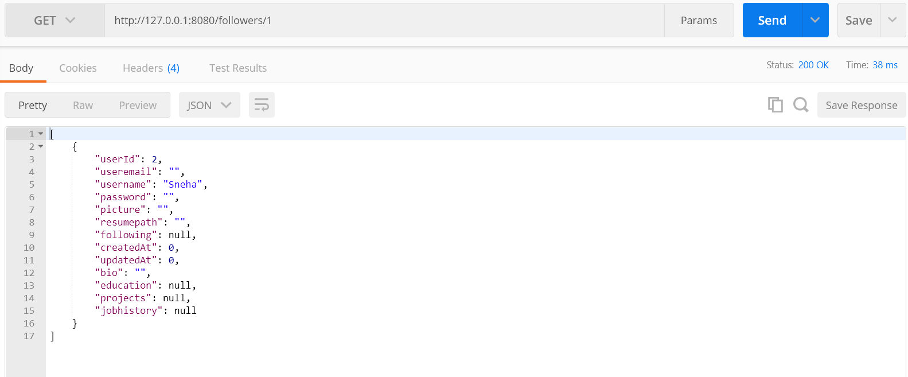


Possible Response status: `200, 404`

Message format: `json`

Example

Code: 200 OK

```
[
    {
        "userId": 2,
        "useremail": "",
        "username": "Sneha",
        "password": "",
        "picture": "",
        "resumepath": "",
        "following": null,
        "createdAt": 0,
        "updatedAt": 0,
        "bio": "",
        "education": null,
        "projects": null,
        "jobhistory": null
    }
]
```

#### Unit Tests

A mock database is created and unit tests are performed on the data from mock DB. The below sections show the unit testing output along with their coverage
#### Connection Requests Unit Tests

Test cases include request, accept and decline of connections with valid and invalid details and also retrieval of pending requests.
<!-- should update screenshot -->
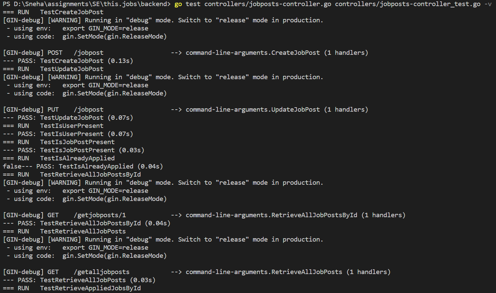
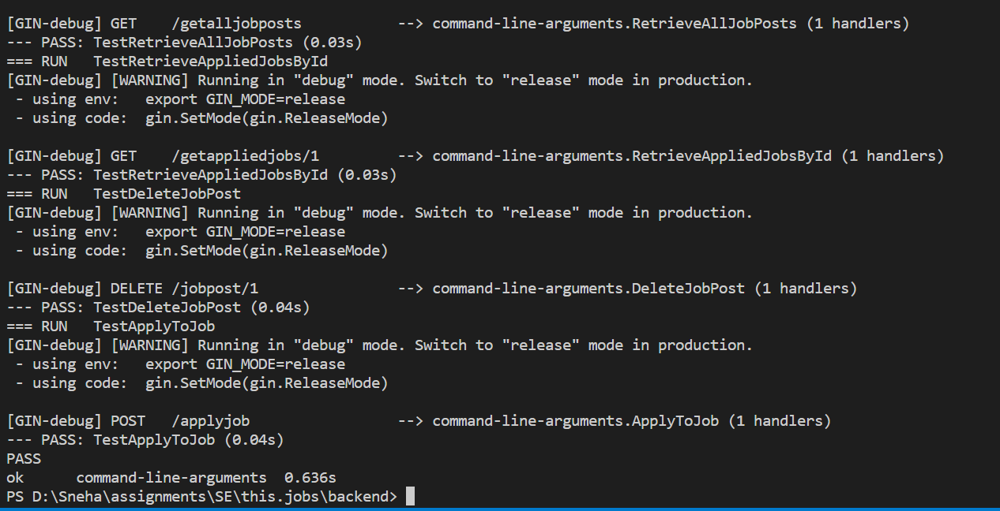


### Frontend accomplishments

